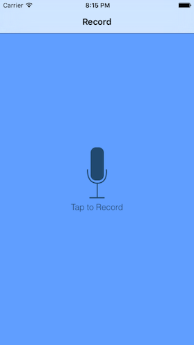
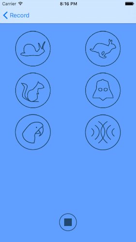

# PitchPerfect

## About

- Two-view iPhone app written in Swift that records a conversation then presents options to slow down, speed up, raise the pitch, lower the pitch, add reverb, or add echo to the recorded voices
- Built in the Udacity course _Intro to iOS Development and Swift_ and incorporates basic iOS functionality and UI elements, Auto Layout, Navigation Controllers, Delegates, Segues, and the AV Foundation framework

## Screenshots

  

